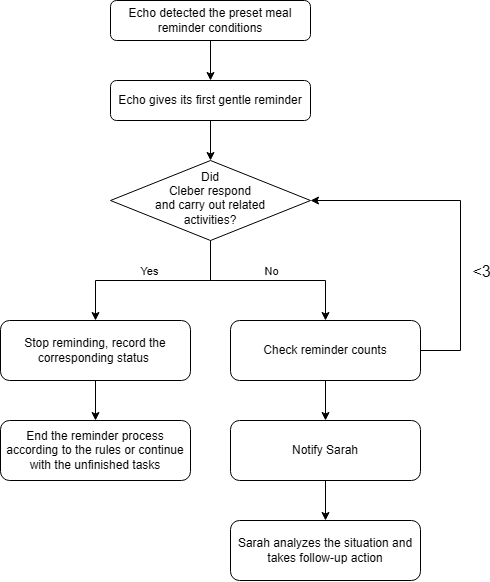

# TDP-01: Graduated Meal Support

| Field | Description |
| --- | --- |
| ID | TDP-01 |
| Name | Graduated Meal Support |
| Status | In Progress |
| Evidence basis | [SA-01](../../1-foundation/operational-demands/activities/SA-01.md) and [PS-01](../../1-foundation/operational-demands/problem-scenarios/PS-01.md); security ([HV-01](../../1-foundation/human-factors/human-values/HV-01.md)), achievement ([HV-02](../../1-foundation/human-factors/human-values/HV-02.md)), [HFC-01](../../1-foundation/human-factors/concepts/HFC-01.md), and technology options [TECH-01](../../1-foundation/technology/TECH-01.md) and [TECH-02](../../1-foundation/technology/TECH-02.md). The effects of this allocation are not yet validated. |
| Problem | Immediate caregiver notification can interrupt Sarah and undermine independence, while relying only on Cleber can leave a missed meal unnoticed. |
| Solution Description | Keep decisions with Cleber, allocate bounded reminders to Echo, and involve Sarah under predefined unresolved-meal conditions. Distinguish meal-related activity from confirmed eating. |
| Consequences: benefits | Opportunities for independent action, with support when needed and potentially fewer unnecessary caregiver interruptions. |
| Consequences: risks | False inference of eating, missed prompts, caregiver unavailability and feeling monitored. |
| Related Patterns | [IDP-01](../interaction-design-patterns/IDP-01.md). |
| Validation path | The expected effects remain unvalidated; use the methods and measures in the associated claims. |

## Solution structure

This source sketch shows the allocation flow. Its decision box's "related
activities" wording is not sufficient proof of eating: [F2](../use-cases/uc01/F2.md) and [UC01-F2-PR2](../use-cases/uc01/UC01-F2-PR2.md)
require confirmed consumption before treating a meal as completed.

## Per-actor allocation

### Echo

- Initiate reminders when the predefined conditions are met.
- Observe responses and meal-related indicators, distinguishing confirmed
  information from uncertain status.
- Offer bounded follow-ups and notify Sarah when escalation conditions are met.

### Sarah

- Review notifications and check meal status when appropriate.
- Decide on suitable follow-up assistance in light of her availability.

### Cleber

- Decide how to respond to reminders.
- Prepare and consume meals independently when able.
- Request help when needed.

## Connection to claims

- [UC01-F1-CL1](../use-cases/uc01/UC01-F1-CL1.md): an initial reminder before caregiver involvement.
- [UC01-F2-CL2](../use-cases/uc01/UC01-F2-CL2.md): bounded follow-ups after an unsuccessful prompt.
- [UC01-F2-CL3](../use-cases/uc01/UC01-F2-CL3.md): limited, non-pressuring support for independence.
- [UC01-F3-CL4](../use-cases/uc01/UC01-F3-CL4.md): handing unresolved situations to Sarah.

The follow-up, autonomy and escalation claim identifiers above correct the
source's mistaken references to the initial-reminder function.
